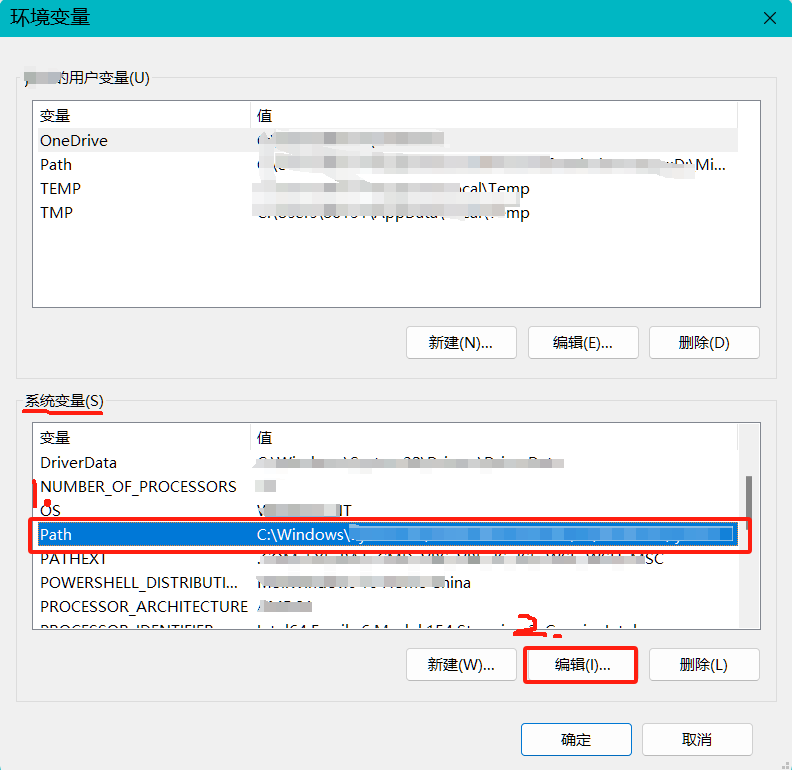
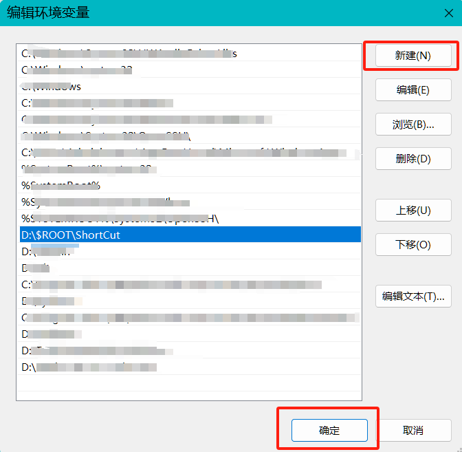
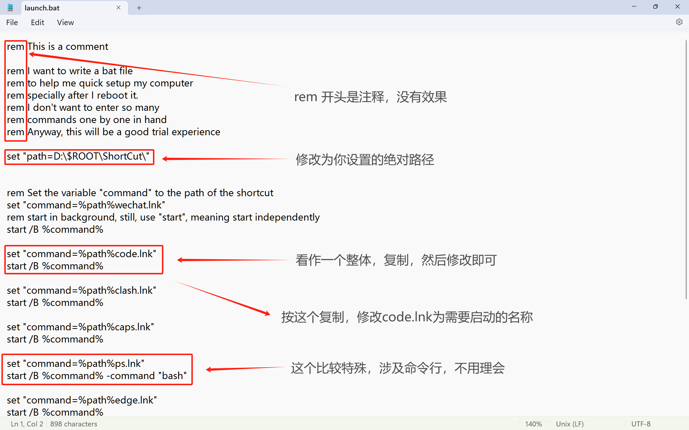
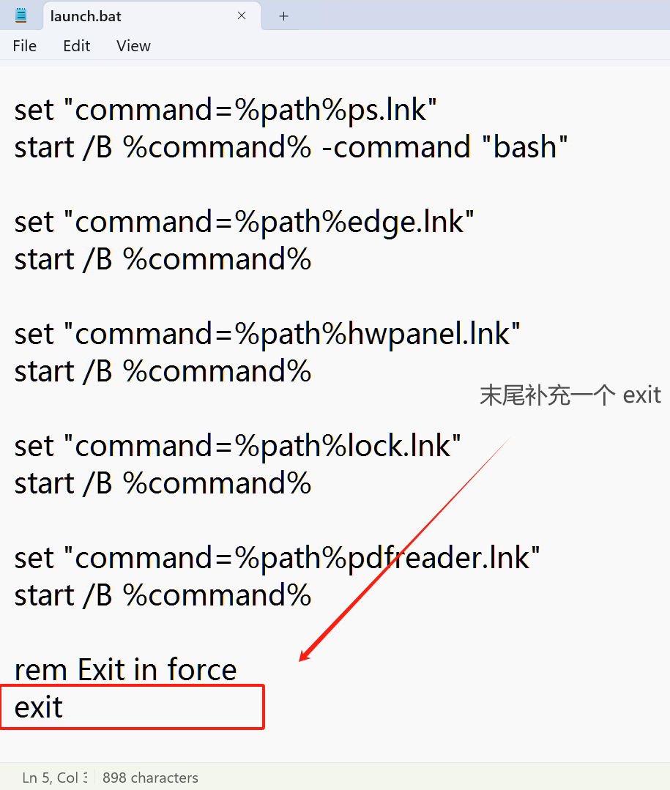

# Guide/指导

## 中文

### 在Win11启动后快速打开软件(针对重启)

尽管软件有记忆功能，能记住关机前打开的文件等，但我的Win11目前还没有做到关机重启后记住关机前打开的应用。

休眠是个非常好的选择，但是电脑总还是会碰上要关机重启的时候。故在人工智能的帮助, 结合之前CSDN上有篇文章介绍的一种应用启动方法，我有了这样一个想法！（***原神启动***(bushi)）
> *PS: 抱歉，没找到CSDN那篇启发我的文章的链接，如果有人找到的可以发PR，我会加上去的。*

### 配置步骤

**PS**：目前该法仅在Win11系统下进行过测试，Win10/7等系统可尝试。Mac/Linux 不清楚 :(

---

- 1. 按下`Win + X`, 选择 `系统(Y)`, 或者点击屏幕下方的Win图标，通过搜索框找到`设置`, 然后点击系统。之后点击`高级系统设置`

---

- 2. 上方选择`高级`, 然后点击`环境变量`

---

- 3. 在`系统变量`中找到`Path`, 然后点击`编辑`

---

- 4. 点击`新建`, 然后输入一个绝对路径, **注意, 路径需要完整, 使用`\`分隔**。这个绝对路径对应的是一个你自己建立的文件夹。如图中，是我建立的文件夹，位于D盘`$ROOT\ShortCut`中。在这个文件夹下，你可以放入你所需软件的**快捷方式**，并编辑文件名为你所容易记忆的名字。同样的，将`launch.bat`放入该文件夹中。

---

- 5. 如图，在这个文件夹下， 放入你所需的快捷方式，更改为容易记忆的名称。

> 仔细观察，看到`explorer`, 这个是Windows系统的**文件资源管理器**, 配合上命令行或者WSL2, 可以实现在不同路径呼出文件资源管理器, 方便**命令行+图形化**管理
>
> explorer原来是 **explorer.exe**, 不是快捷方式, 是源文件的复制 。
>
> 对比图中的`ppt`, 一个快捷方式，嗯， 有些软件需要呆在原来的位置（有环境依赖）。

---

- 6. 将`launch.bat`放入该文件夹中。 用编辑器打开这个文件

---

> 该图中, `rem` 后面的为注释

- 7. `set "path=D:\$ROOT\ShortCut\"` 这里需要将`D:\$ROOT\ShortCut\`替换为你自己的绝对路径
- 8. `set "command=%path%wechat.lnk"` 这里将`wechat`改为你设置的名称。这些快捷方式就是`launch.bat`这个文件将会运行的

---

- 9. 保存文件，重启电脑使之前改变的环境变量生效，然后按下`Win + R`打开`运行`, 输入`launch`，回车。就可以看到你设置的快捷方式被打开了。
  
> PS: **注意**, 输入`launch`, 不用带后缀名`.bat`,  当然, 带上也可。

### 效果

---

> 这是我设置的。类似的，输入你设置的名称即可实现单独打开某个应用程序。

## English

### Quick Open Tools After Your Win11 Setup(Focus on Reboot)

Waitting for update... :(
